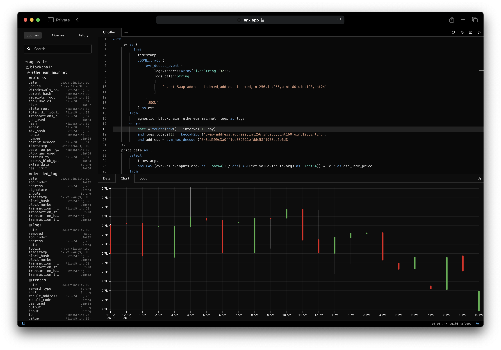

# agx

**_agx_** is a desktop application built with Tauri and SvelteKit that provides a modern interface for exploring and querying data using ClickHouse's embedded database engine (chdb).

## Preview



## Features

- Native desktop application performance with web technologies
- Interactive SQL query editor with syntax highlighting
- Schema browser for exploring data structure
- Results displayed in a tabular format
- Support for drag & drop file operations
- Cross-platform compatibility (macOS, Linux, Windows)

## Prerequisites

- Node.js (v16 or later)
- Rust toolchain
- System dependencies for Tauri

## Getting Started

### → Live

https://agx.app

### → Local

1. Clone the repository:

```bash
git clone https://github.com/agnosticeng/agx
cd agx
```

2. Run with docker compose:

```bash
docker compose up
```

3. Access the application via http://localhost:8080

### → Native

1. Clone the repository:

```bash
git clone https://github.com/agnosticeng/agx
cd agx
```

2. Download and setup chdb library:

```bash
./src-tauri/update_libchdb.sh
```

3. Install dependencies:

```bash
npm install
```

4. Run in development mode:

```bash
npm run tauri dev
```

5. Build for production:

```bash
npm run tauri build
```

## Project Structure

```
agx/
├── src/                 # Frontend source code (SvelteKit)
│   ├── lib/             # Shared components
│   └── routes/          # Application routes
├── src-tauri/           # Backend source code (Rust)
│   ├── src/             # Rust source files
│   └── Cargo.toml       # Rust dependencies
├── package.json         # Node.js dependencies
└── README.md
```

## Installing Agnostic UDF

Install Agnostic ClickHouse UDFs with a single command:

```bash
curl -fsSL https://raw.githubusercontent.com/agnosticeng/agx/main/scripts/install_agnostic_udfs.sh | sh
```

## Development

- The frontend is built with SvelteKit, offering a reactive and efficient UI
- The backend uses Tauri with Rust, providing native performance and security
- Communication between frontend and backend happens through Tauri's IPC bridge
- Data querying is handled by chdb, an embedded ClickHouse engine

## Contributing

Contributions are welcome! Please feel free to submit a Pull Request.

## License

This project is licensed under the MIT License - see the [LICENSE](LICENSE) file for details.

The MIT License is one of the most popular open-source licenses because it:

- Is simple and permissive
- Allows commercial use
- Allows modification and distribution
- Allows private use
- Has minimal restrictions
- Is compatible with many other licenses
